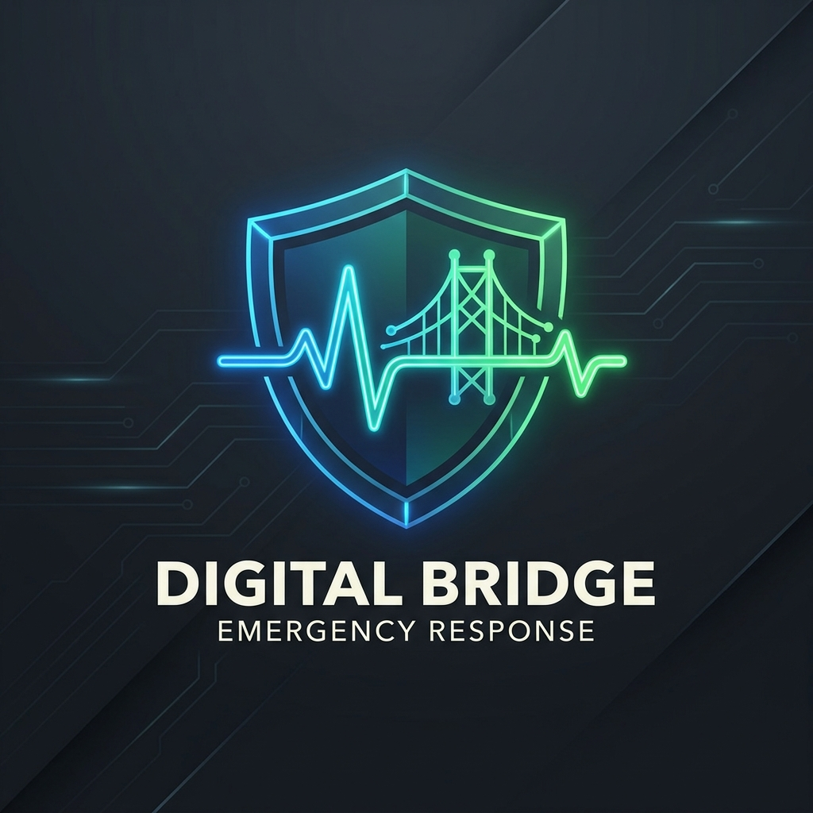

<div align="center">

# 🚨 LifeBridge AI
### Intelligent Emergency Response & Disaster Management Platform
---
### AI-Powered Emergency Response, Disaster Management & Community Safety Platform
---

<p align="center">
Helping Communities Stay Safe During Disasters
</p>



<br>

[](https://life-bridge-ai-final.vercel.app)

[](https://github.com/himanshujoshimlg-debug/LifeBridge-AI-Final)

</div>

---

# 📖 About

LifeBridge AI is an intelligent web application designed to assist people during natural disasters and emergency situations.

The platform provides quick access to shelters, safe routes, emergency medical guidance, volunteer coordination, emergency supplies, and AI-powered assistance through a simple and user-friendly interface.

---

# ✨ Features

✅ AI Emergency Assistant

✅ Shelter Finder

✅ Safe Route Navigation

✅ Disaster Alerts

✅ Medical First Aid

✅ Missing Person Support

✅ Volunteer Management

✅ Emergency Supplies

---

# 🖥️ Live Website

## https://life-bridge-ai-final.vercel.app/

---

# 📸 Website Layout


---

# 🛠️ Technology Stack

| Technology | Purpose |
|------------|---------|
| HTML5 | Structure |
| CSS3 | Styling |
| JavaScript | Functionality |
| Leaflet.js | Interactive Maps |
| Git | Version Control |
| GitHub | Repository Hosting |
| Vercel | Deployment |

---

# 📂 Project Structure

```
LifeBridge-AI-Final
│
├── index.html
├── styles.css
├── app.js
├── server.js
├── package.json
├── modules/
│     ├── assistant.js
│     ├── map.js
│     ├── shelters.js
│     ├── medical.js
│     ├── volunteer.js
│     ├── supplies.js
│     ├── roads.js
│     └── checkin.js
│
└── lifebridge_logo.png
```

---

# 🚀 Installation

Clone the repository

```bash
git clone https://github.com/himanshujoshimlg-debug/LifeBridge-AI-Final.git
```

Move into project

```bash
cd LifeBridge-AI-Final
```

Install dependencies

```bash
npm install
```

Start

```bash
npm start
```

---

# 🎯 Future Enhancements

- AI Disaster Prediction
- Real-time Government Alerts
- Live Weather Integration
- SOS Notification System
- Offline Emergency Mode
- Mobile Application

---

# 🌍 Deployment

The application is deployed on **Vercel**.

Live Link

https://life-bridge-ai-final.vercel.app/

---

# 👨‍💻 Developer

**Himanshu Joshi**

GitHub

https://github.com/himanshujoshimlg-debug

---

# ⭐ Support

If you like this project, don't forget to ⭐ Star the repository.

---

<div align="center">

Made with ❤️ using HTML, CSS & JavaScript

</div>
